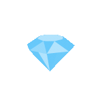

<p align="center"></p>

###  A little more about me...

```javascript
const response = {
  status: 200,
  data: {
    fullName: "Parsa Farjad",
    birthDay: "2002 October 17",
    languages: ["Javascript" , "Typescript" , "HTML" , "CSS"],
    skills: [
      "React", "Redux", "Next", "ThreeJs", "WebSocket", "GraphQL", "PWA", "ESlint", "RegEx",
      "Tailwind", "Bootstrap", "MUI", "Styled-Components",
      "Figma", "Xd", "Photoshop", "Illustrator", "Premiere", "AfterEffects", 
      "Git" , "Github" , "Gitlab"
    ],
    university: "Computer Engineering Azad University, Karaj Branch",
  },
};
```
<br/>

<h3>My Skills...</h3>
<p>
  
  
  
  
  
  
  
  
  
  
  
  
  
  
  
  
  
  
  
  
  
  
  
  
</p>
<hr/>
<h3> Connect Me...</h3>
<p>
  <a href="https://instagram.com/_parsafarjad" target="_blank"></a>
  <a href="https://t.me/parsa_farjad" target="_blank"></a>
  <a href="https://parsafarjad.ir" target="_blank"></a>
  <a href="mailto:parsa.farjad81@gmail.com" target="_blank"></a></p>
